目   录

**第1章 概 述**..............................................

**1.1** **选题来源**..........................................

**1.2** **选题的意义**.......................................

**第2章 项目分析**...................................... 

**2.1** **技术选型**.........................................

**2.2** **功能分析**.........................................

 

 

第一章 概述

   **1.1****选题来源**

该瓷砖销售系统的选题来源是对市场需求的调研和分析，以及对瓷砖销售行业的发展趋势进行研究。

   **1.2****选题的意义**

瓷砖销售系统的建设对于提高销售效率、优化客户体验以及降低运营成本具有重要意义，能够帮助企业更好地应对市场竞争，提升盈利能力。

第二章 项目分析

   **2.1****技术选型**

根据项目需求和现有的技术栈，采用以下技术进行系统完善：

·后端：Spring框架搭建Java后端，使用MyBatis作为持久层框架，MySQL作为数据库存储数据。

·前端：使用Vue2构建前端页面，利用Axios进行数据交互，同时采用Element组件库进行页面设计和交互。 

**2.2****功能分析**

①本项目用于实现一个瓷砖销售的后台管理系统，因此应包含以下功能:

（1）用户管理：

·管理员用户注册：注册成为系统的管理员员，提供用户名、密码等信息。

·管理员用户登录：登录后台管理系统，进行系统的管理、维护等操作。

·用户信息展示：展示用户的详细信息，包括编号、用户名、姓名、性别、手机号、身份证号、头像、创建时间、瓷砖送达的详细位置。

·新增普通用户：管理员可以根据相应的信息进行普通用户的创建。

·删除普通用户：管理员可以删除网站的普通用户。

·更新普通用户：管理员可以更改网站的普通用户的各项信息。

·查找普通用户：管理员可以通过用户的用户编号、用户名、姓名、性别、手机号进行相似搜索。

（2）瓷砖管理:

·瓷砖信息展示：展示瓷砖的详细信息，包括价格、规格、材质等，并提供图片展示。

·新增瓷砖：管理员可以根据相应的信息进行瓷砖的创建。

·删除瓷砖：管理员可以删除瓷砖。

·更新瓷砖：管理员可以更改瓷砖的各项信息。

·查找瓷砖：管理员可以通过瓷砖的编号、姓名、风格、类型、状态进行相似搜索。

（3）购物车管理：

·添加商品：用户可以将感兴趣的瓷砖添加到购物车中。

·修改商品数量：用户可以修改购物车中商品的数量。

·删除商品：用户可以从购物车中删除不需要的商品。

(4)订单管理：

提交订单：用户可以将购物车中的商品生成订单，并进行提交。

订单支付：用户可以选择合适的支付方式进行订单支付。

订单查询：用户可以查询自己的订单状态和历史订单记录。

订单管理：管理员可以对订单进行管理，包括订单状态修改、订单详情查看、删除订单等。

②项目实现

   由于时间有限，仅实现了上述功能的部分实现。

\1. 后台登录页面 

地址:127.0.0.1:8888  浏览器输入该地址时，会自动跳转127.0.0.1:8888/login页面

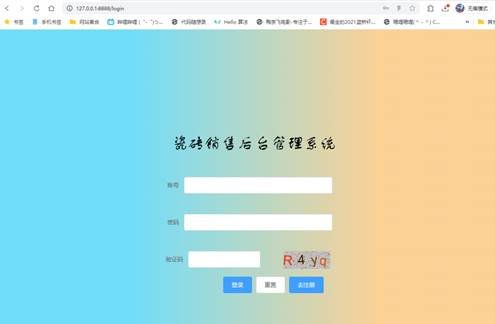

点击重置按钮会清空表格内的数据，点击小眼睛图标可以显示密码

点击注册时会跳转注册页面，注册页面有 去登陆 按钮，可以回到登录页面

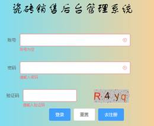

点击登陆时会检验表单的完整性,内容完整才可以登录。

 

 

信息有误会相应报错。注册页面同理

 

 

信息完整会直接跳转到/index页面。同时会判断是否携带jwt令牌。如果手动输入对应的路径/index会返回到login页面

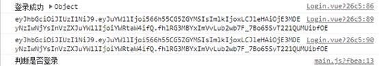

\2. index页面

下面的图片是index页面的用户管理栏 

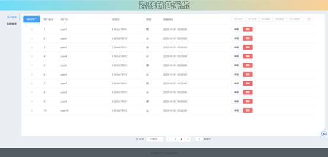

可以点击订单管理切换到订单管理栏

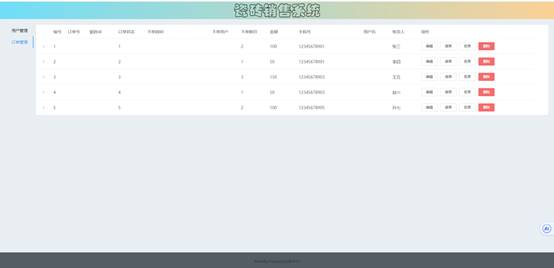

 

 

在用户管理界面，可以点击某一列使其展开，显示用户的详细信息（此处图片本身不能加载）

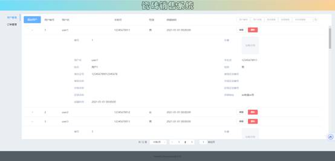

下方的分页栏显示了数据总量以及每页对应显示的数目，可以通过点击切换

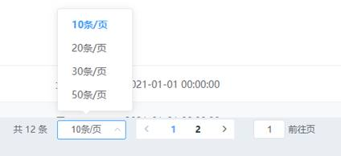

此外可以通过点击对应页码或输入页码来前往对应的页面

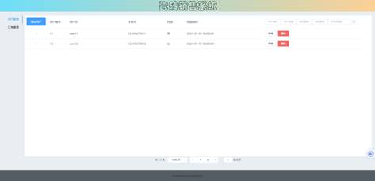

当页面总量小于设置的每页显示数目时，该分页栏会隐藏。

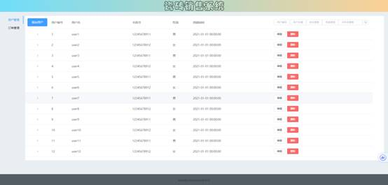

可以通过右上方的搜索框进行一系列(可设多个条件)搜索

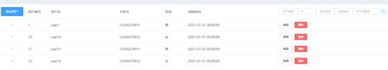

可以点击删除按钮删除对应的用户信息，页面会自动刷新

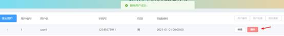

刷新后的结果

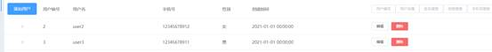

也可以点击编辑按钮编辑用户信息

下图为user2的信息,我们可以点击编辑为其上传一个头像

(注:根据缩放的不同，编辑和添加用户可能会产生样式的不协调)

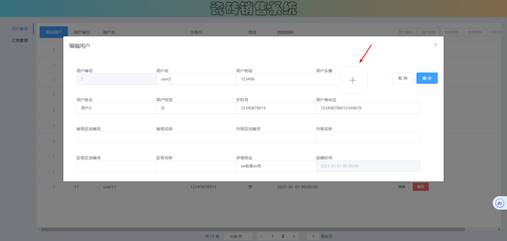

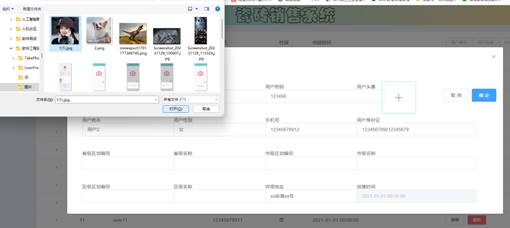

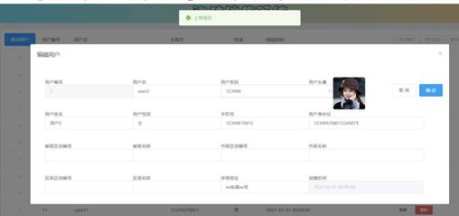

然后点击确定便会保存用户信息

等待页面刷新后便可查看到用户对应头像的变化

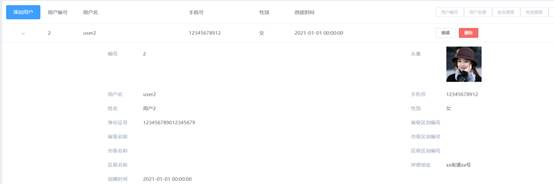

添加用户界面与编辑界面大致相同

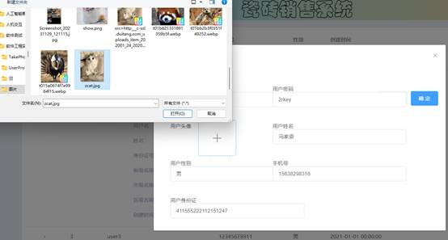

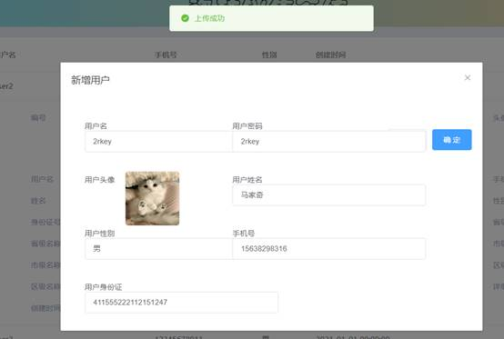

然后等待页面刷新便可看到对应的用户信息已经添加

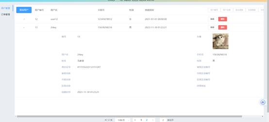

（注:上传的文件仅支持jpg,若格式不正确会提示）

由于时间的原因，订单管理仅实现了查询详细信息的功能，其它功能均未实现。

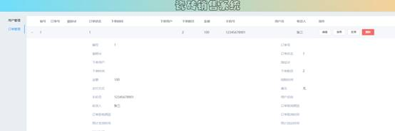

